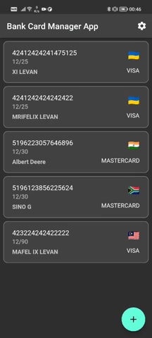
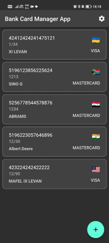
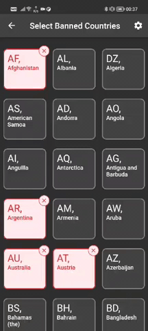
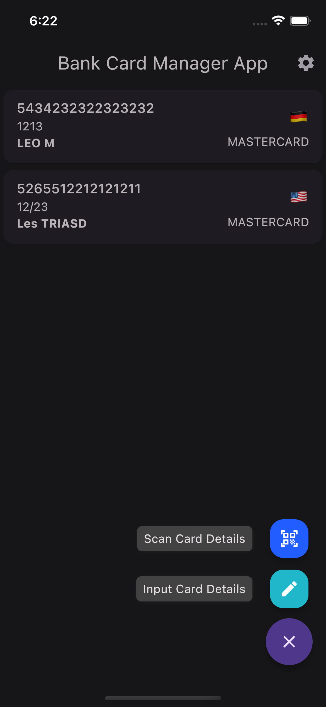
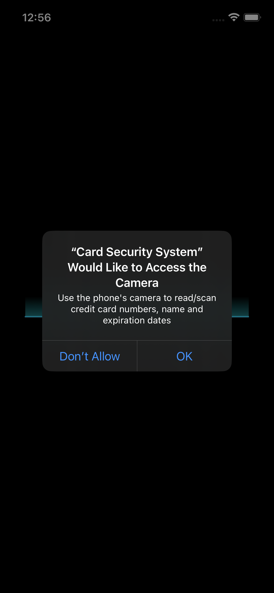
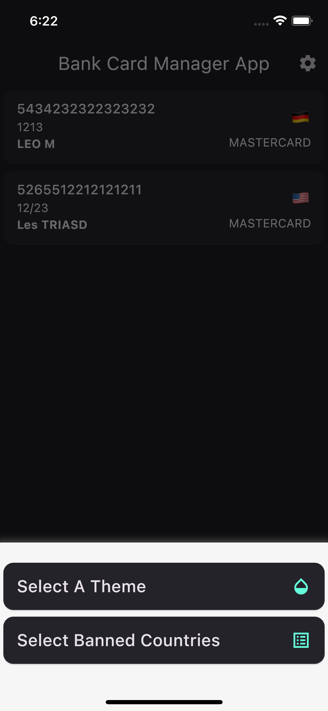

## card_security_system

A powerful system that allows admins to submit credit card numbers for validation. With this app, you can easily check whether a credit card number is valid or not.

You can quickly and securely verify credit card numbers in real-time. Simply enter the card number into the app, and our system will perform an instant check to ensure that the card is valid and not expired. You can also check the card's issuer and the card type (Visa, Mastercard, American Express, etc.) to further improve your fraud detection capabilities

### Key Features:

- Validate credit card numbers in real-time
- Check the card's issuer and type
- With a convenient feature to scan bank card details
- Configure/select banned countries
- Change theme or use default system theme
- Persistent data (card details, user theme, selected countries), across sessions.

---

    
    
    

      
      
      

---

- **PLEASE NOTE that the project relies on a rate-limited API, so if you exhaust the credits, it might not be able to provide a country name for some of the records.**
